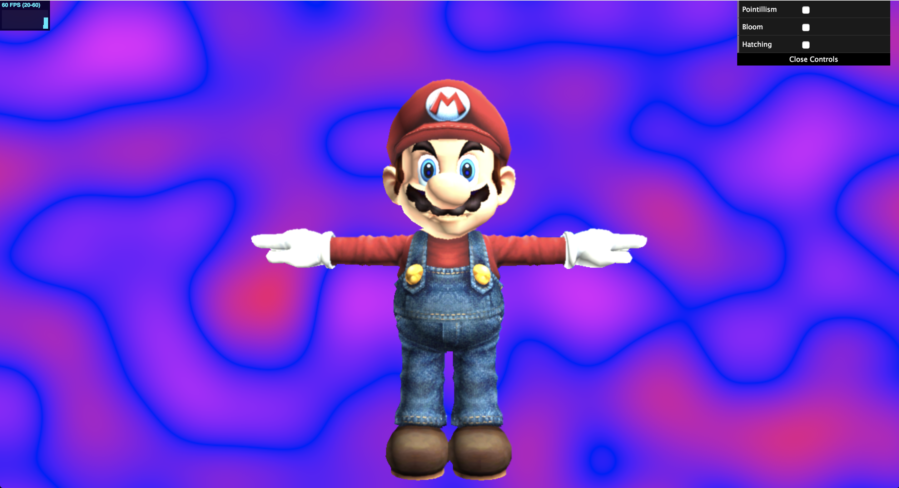
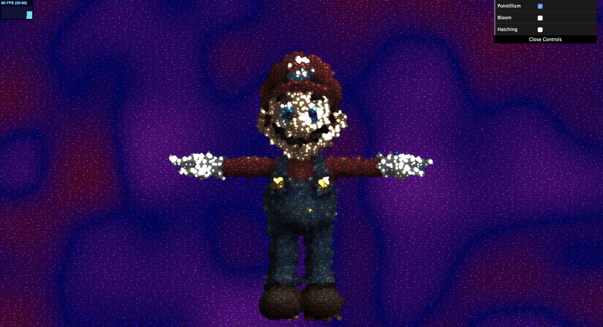
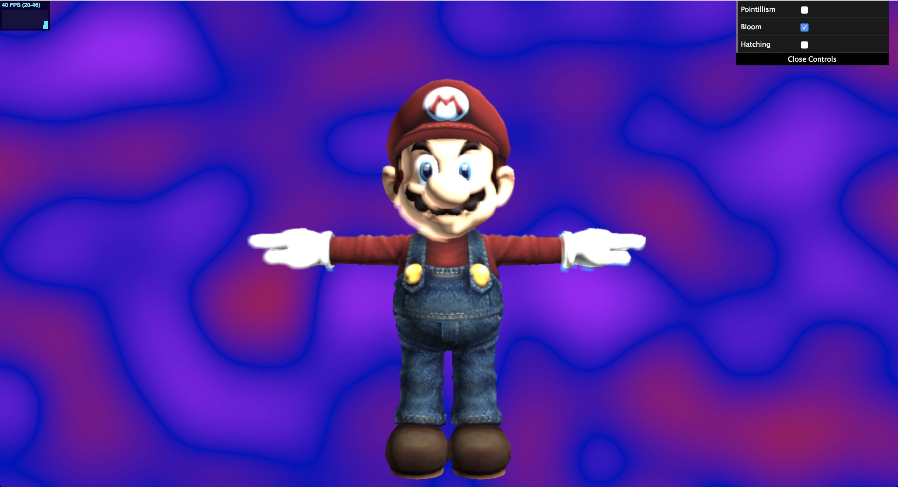
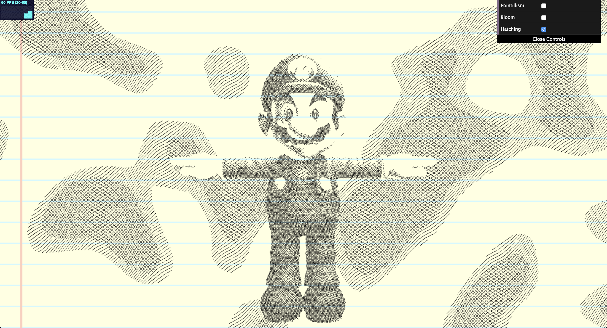
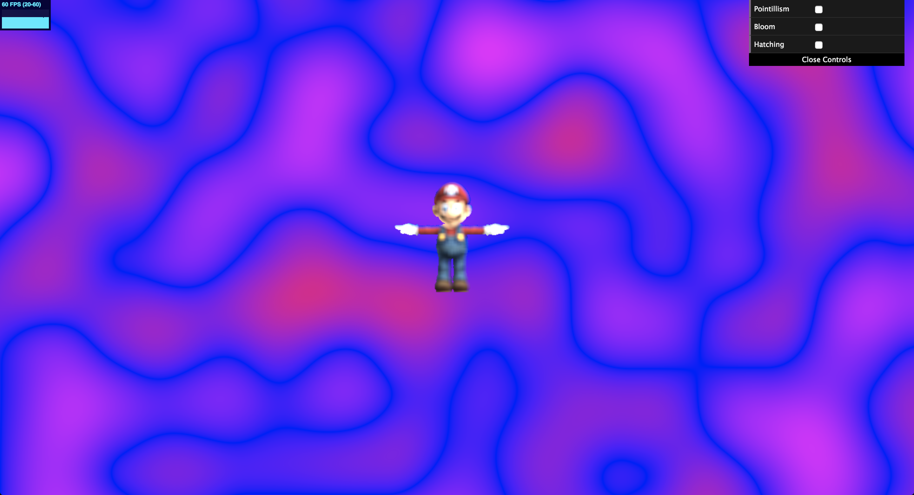

# Project 7: Deferred Renderer

# Deferred Renderer

# Demo Link
https://ishanranade.github.io/DeferredRenderer/

# Features

## Shaders

Pointillism

Bloom

Hatching

Depth of Field

## Technical Details

The data that I passed through the G-Buffers included the camera position and the near and far clip, the albedo color of the point, the normal, the depth value, and the dimensions of the screen.  For the post processing shaders, I altered the framebuffer flipping to instead have a streamlined flow, mainly because of the bloom shader.  For the bloom shader I start with one buffer that extracts the pixels above a certain luminence, then the second buffer blurs these, and then the third buffer averages the first two buffers.  For pointillism, I used worley noise to create random points around the screen and increased the radius of color around the point based on the luminence of that area.  For hatching, I created a diagonal line for each area using a sin curve and changed the direction of this line over time.  Then, I hardcoded in blue lines and red lines to give it the appearance of notebook paper.  For the depth of field, I used the depth value to dynamically create a gaussian kernel with a sigma that increases as the depth increases, then applied the kernel to this pixel.

## Extra Credit

For extra credit I implemented the extra shader hatching.  For extra credit I also included a GUI in which the user can toggle pointillism, bloom, and hatching.  They will be applied in order from top to bottom in the GUI if the user chooses some or all of them.
